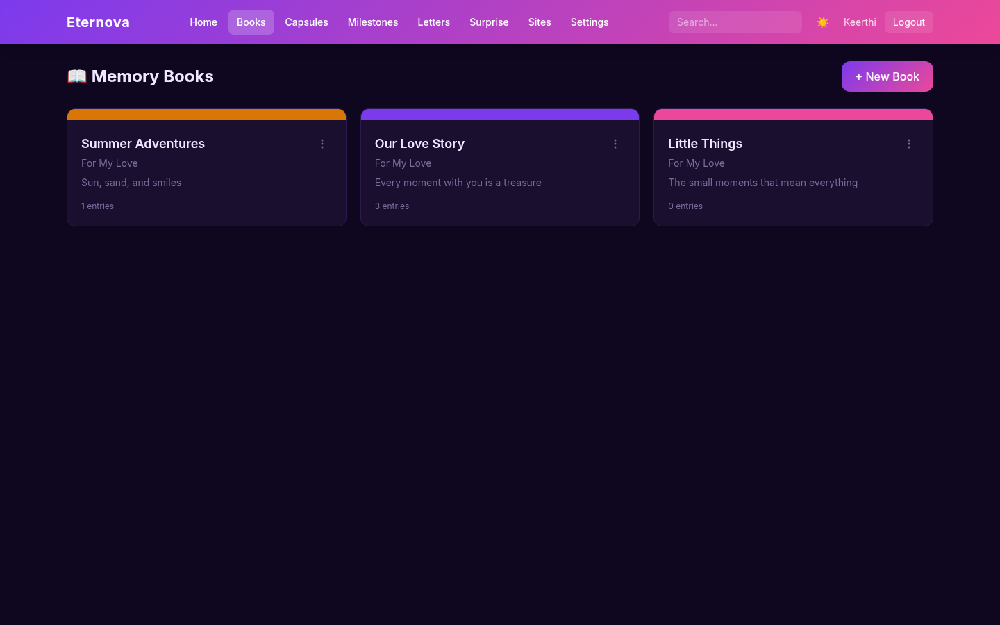
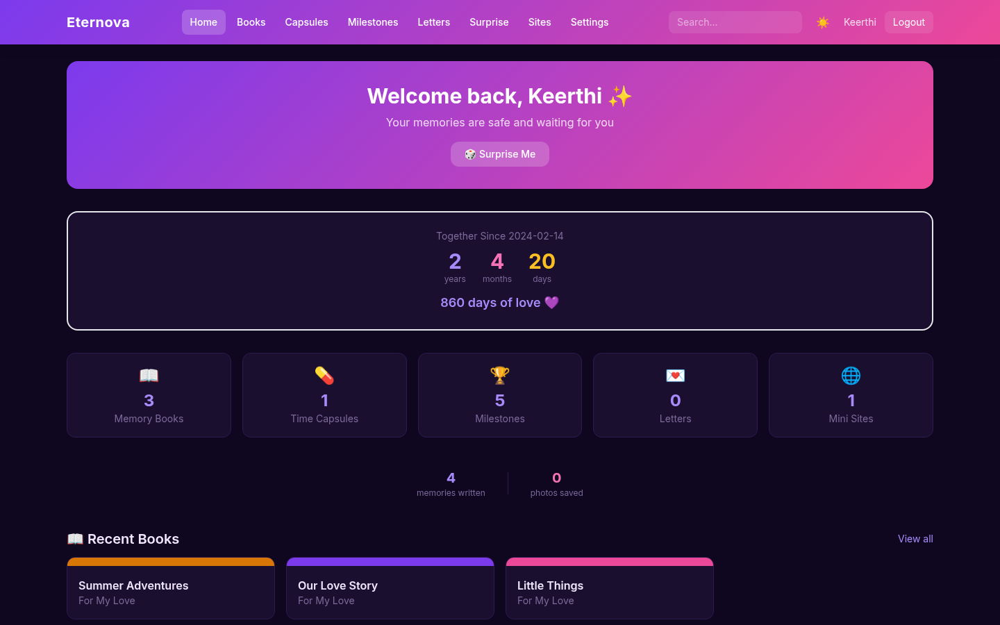
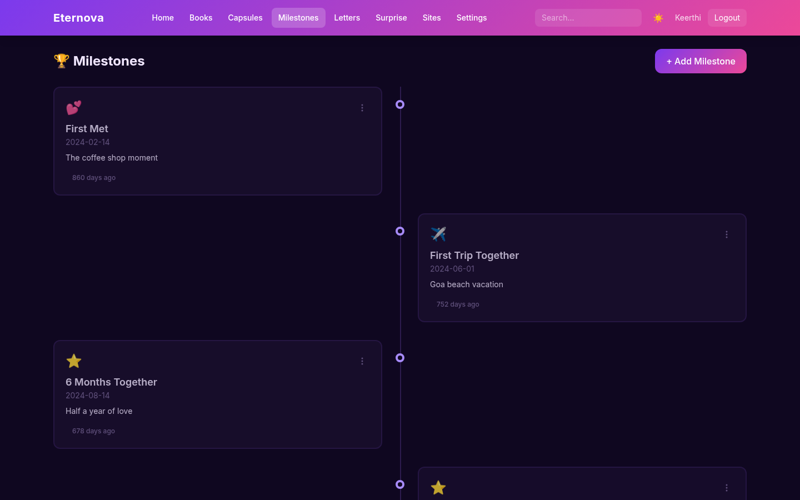
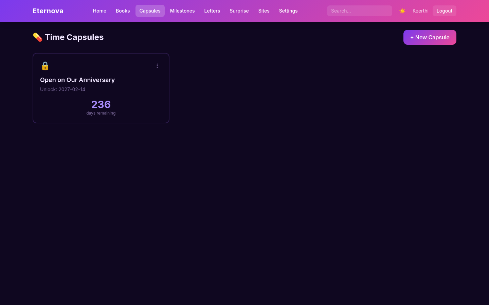
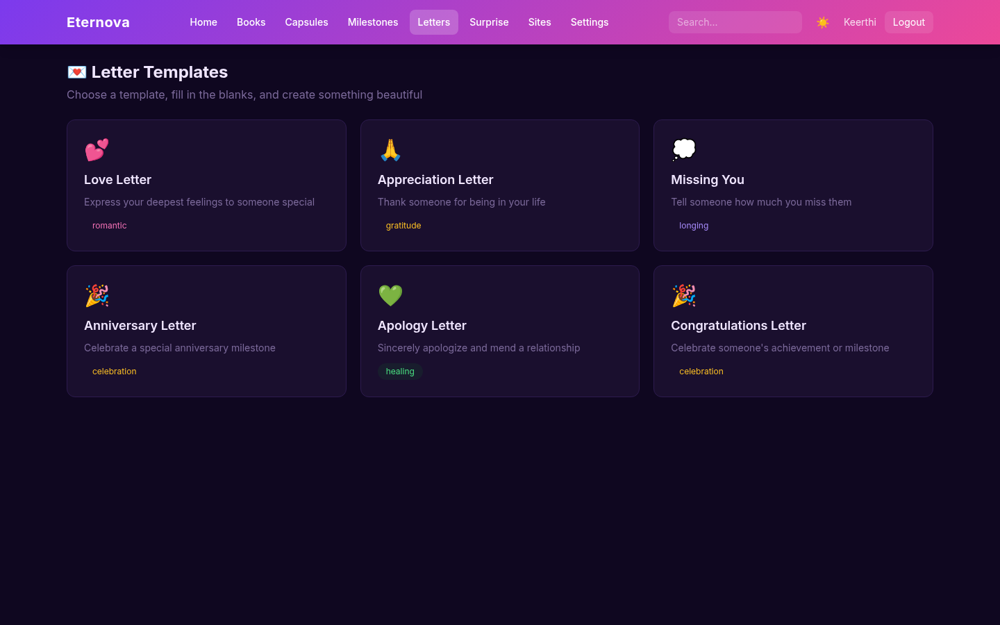
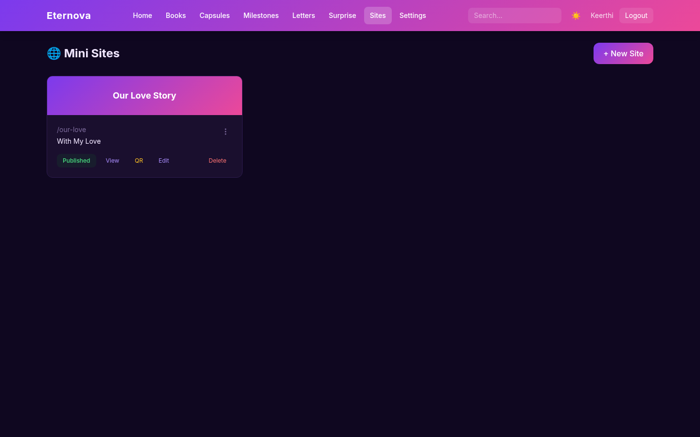
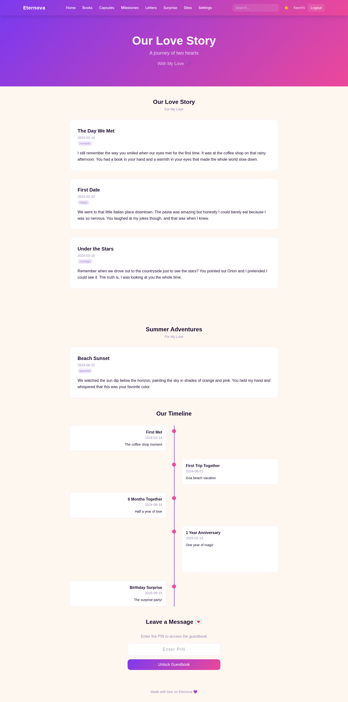
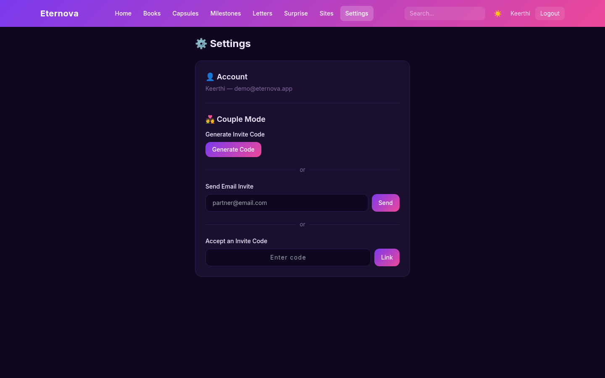

# Eternova

**A Secret Love & Relationship Memory Platform**

Eternova lets you preserve love stories, memories, and milestones in a beautiful, private space. Create memory books, seal time capsules, track milestones, write love letters, and build personalized mini-websites — all in one place.

## Screenshots

### Dashboard

*Welcome screen with Together Since counter, stats, Surprise Me button, and recent books*

### Memory Books

*Book library with 3-dot details menu*

### Book Reader

*Page-flip reader with Spotify embed, PDF export, and share link*

### Milestone Timeline

*Alternating timeline with category icons and countdown badges*

### Time Capsules

*Locked capsules with countdown, unlocked ones ready to reveal*

### Letter Templates

*6 fill-in-the-blank templates with category badges*

### Mini-Sites

*Site management with publish toggle, QR code, and edit*

### Public Mini-Site

*Full public site with books, timeline, and PIN-protected guestbook*

### Settings (Couple Mode)

*Partner linking via invite code or email*

### Dark Mode

*Romantic dark theme with purple/pink/gold palette*

## Features

### Core Features
- **Memory Books** — Create books with entries, photos, mood tags, and Spotify song links. Share via secret link.
- **Time Capsules** — Write messages locked until a future date. Server-enforced — content never visible before the unlock date.
- **Milestone Tracker** — Timeline of important dates with categories, countdown badges, and Spotify integration.
- **Letter Generator** — 6 fill-in-the-blank templates (love letter, appreciation, missing you, anniversary, apology, congratulations) with live preview.
- **Mini-Websites** — One-page personalized sites with multiple books, selected entries, milestone picker, 4 visual themes, and PIN-protected guestbook.

### Social Features
- **Couple Mode** — Link accounts via invite code or email. Once linked, both partners see each other's books, capsules, and milestones.
- **Guestbook** — PIN-protected messaging on mini-sites so your special person can leave notes.
- **Surprise Letters** — Schedule love letters to be emailed on a future date via Gmail SMTP.
- **Google Sign-In** — One-click login/register via Google account. Auto-links with existing email accounts.
- **Forgot Password** — Email-based password reset with 6-digit code (15-minute expiry).

### Discovery Features
- **On This Day** — Dashboard shows entries and milestones from the same date in previous years.
- **Together Since** — Set your relationship start date and see a live counter (years, months, days).
- **Random Memory** — "Surprise Me" button that shows a random entry from any book.
- **Global Search** — Search across books, entries, and milestones from the navbar.

### Tools
- **PDF Export** — Download entire memory books as formatted PDFs with photos.
- **QR Code** — Generate downloadable QR codes for published mini-sites.
- **Spotify Integration** — Attach songs to books and milestones, rendered as embedded players.
- **Mood Tags** — Tag entries with emotions (happy, romantic, nostalgic, grateful, excited, peaceful, sad).
- **Dark Mode** — Romantic purple/pink/gold palette with light/dark toggle.
- **3-Dot Details Menu** — Created time, status, and quick actions on every item.

### Mini-Site Themes
| Theme | Style |
|-------|-------|
| Romantic | Warm purples, soft pinks, gradient headers |
| Minimal | Clean white, subtle typography |
| Vintage | Sepia tones, serif fonts |
| Neon | Dark background, glowing accents |

## Tech Stack

| Layer | Technology |
|-------|-----------|
| Frontend | Next.js 14 (App Router), TypeScript, Tailwind CSS, Framer Motion |
| Backend | FastAPI, Python 3.11 |
| Database | SQLite (WAL mode, 15 tables) |
| Auth | Custom JWT (PBKDF2 + HS256) + Google OAuth |
| Email | Gmail SMTP (password reset + surprise letters) |
| PDF | jsPDF |
| QR | qrcode.react |
| Deploy | Vercel (frontend) + Render (backend) |

## Quick Start

### Prerequisites
- Python 3.11+
- Node.js 18+
- npm

### Backend
```bash
cd backend
python3.11 -m venv venv
source venv/bin/activate
pip install -r requirements.txt
cp .env.example .env
uvicorn main:app --port 8001 --reload
```

### Frontend
```bash
cd frontend
npm install
echo "NEXT_PUBLIC_API_URL=http://localhost:8001" > .env.local
npm run dev
```

Open http://localhost:3000 and register to start.

## Project Structure

```
eternova/
├── backend/                    # FastAPI backend
│   ├── main.py                 # App entry, CORS, routers, scheduled letter loop
│   ├── api/
│   │   ├── models.py           # Pydantic schemas
│   │   └── routes/             # 11 route files, 40+ endpoints
│   ├── core/                   # Auth (JWT + Google OAuth), email, photos, sharing, templates
│   └── state/
│       └── database.py         # SQLite schema (16 tables) + migrations
├── frontend/                   # Next.js frontend
│   └── src/
│       ├── app/                # 21 page routes
│       ├── components/         # DetailsMenu, SpotifyEmbed, Navbar, SearchBar
│       ├── context/            # Auth + Theme providers
│       └── lib/                # API client, types, PDF export, site themes
├── CLAUDE.md                   # Development reference
├── render.yaml                 # Render deployment config
└── .gitignore
```

## API Overview

| Category | Endpoints | Auth |
|----------|-----------|------|
| Auth | Register, Login, Google OAuth, Me, Forgot/Reset Password | No/Yes |
| Books | CRUD + entries + photos + share | Yes |
| Capsules | CRUD + lock enforcement | Yes |
| Milestones | CRUD + upcoming | Yes |
| Letters | Templates + drafts | Yes |
| Sites | CRUD + multi-book + publish | Yes |
| Dashboard | Stats, search, random, together-since | Yes |
| Scheduled Letters | CRUD | Yes |
| Couple | Invite, accept, status, unlink | Yes |
| Public | Shared books, sites, guestbook | No |

## Environment Variables

### Backend (.env)
| Variable | Description |
|----------|-------------|
| `JWT_SECRET` | Secret for JWT signing |
| `DB_PATH` | SQLite path (default: `./eternova.db`) |
| `CORS_ORIGINS` | Allowed origins (comma-separated) |
| `GMAIL_USER` | Gmail for password reset & surprise letters |
| `GMAIL_APP_PASSWORD` | Gmail app password |
| `GOOGLE_CLIENT_ID` | Google OAuth Client ID |

### Frontend (.env.local)
| Variable | Description |
|----------|-------------|
| `NEXT_PUBLIC_API_URL` | Backend URL |
| `NEXT_PUBLIC_GOOGLE_CLIENT_ID` | Google OAuth Client ID |

## Deployment

**Backend (Render):**
- Runtime: Docker
- Root Directory: `backend`
- Free tier works

**Frontend (Vercel):**
- Framework: Next.js
- Root Directory: `frontend`
- Set `NEXT_PUBLIC_API_URL` to Render URL
- Set `NEXT_PUBLIC_GOOGLE_CLIENT_ID` to Google OAuth Client ID

---

Built with love by [KeerthiShree TS](https://github.com/keerthishree20)
